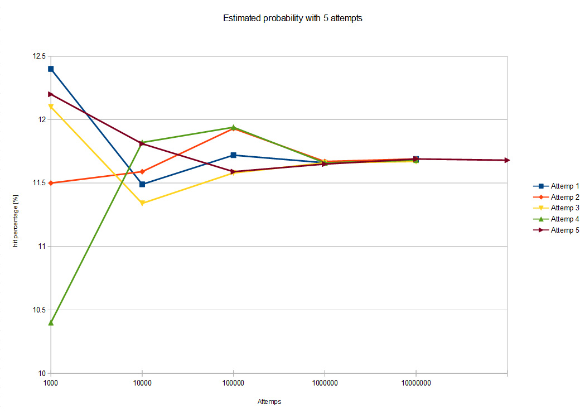

# Leander
Leandergames challenge

# Description
This program is the results of the Leandergames interview challenge. The statement is copied below:

_Python Test

Consider the following game:

From one deck of poker cards (52 cards) you place cards face up in a ring of 12 positions. The 13th card is placed
in the middle of the ring. If an Ace was put on the first position (“place one”) or a deuce on “place two” and so
on (a king on “place 13”) you have a match. You simply skip that place on the next lap and continue to place
cards on top of the cards not corresponding to their positions.

Every time you have a new match you pick up the cards on that certain position and place them in the bottom of
your deck and leave the matched card on its position in the ring. You continue this procedure until you either
run out of cards or have all 13 positions matched.

You win if you have all 13 positions matched.

What is the probability of winning the game?

Please provide the answer together with simulation code in Python._

# Answer

_Spoiler Alert_

The results of this research is the probability to win in this game is (11.68 ± 0.035)%. Its development will be explained below. 

# How to use

To run de code, just run "juego.py". In the "mazo.py" are specified the classes used in this program. Since the probability of winning this game is too complex to calculate mathematically, we resorted to test code that calculates the percentage of wins, experimentally. To run the test, just run "test.py", it will run 5 attemps to get the probability with 3σ to get 99.7% confidence of the result, where σ is the standard deviation. The program will create a file for each of the tests carried out.

# Requirements

Python 3.7 or above. No extra module will be requiered.

# Results

The result of this experiment yielded the following values:

Attempts    | Test 1   |	 Test 2 	|  Test 3	  |  Test 4	  |  Test 5
:---------: | :------: | :--------: | :-------: | :-------: | :------: 
1,000       |	 12.4    |  	11.5    | 	 12.1   |	  10.4	  |   12.2
10,000      |  11.49	 |   11.59    |    11.34	|   11.82   | 	11.81
100,000     |  11.72	 |   11.93    |    11.58	|   11.94   | 	11.59
1,000,000   |  11.66	 |   11.67	  |    11.66	|   11.66	  |   11.65
10,000,000  |  11.69	 |   11.69    |    11.67	|   11.68	  |   11.69
100,000,000 |	         |            |           |           |   11.68

Note that only in the last case, more than 10,000,000 tests were required to confirm a trend with a variation of less than 0.003% less than the previous order of magnitude. 

The final result is (11.68 ± 0.035)% probability of winning this game, according to the tests carried out.

# Version 

Version 1.0

# Author

* Javier Carugno
* Electronic engineering student at National Technological University, Argentina
* javiercarugno@gmail.com
